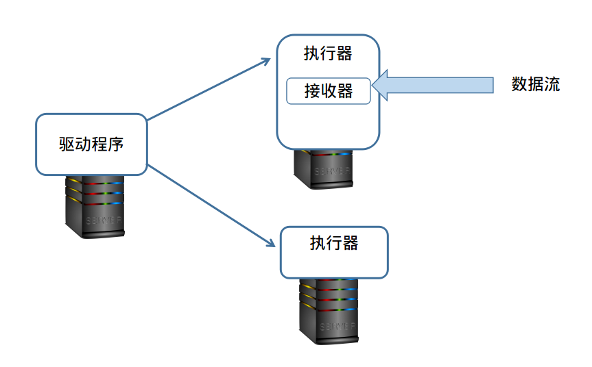
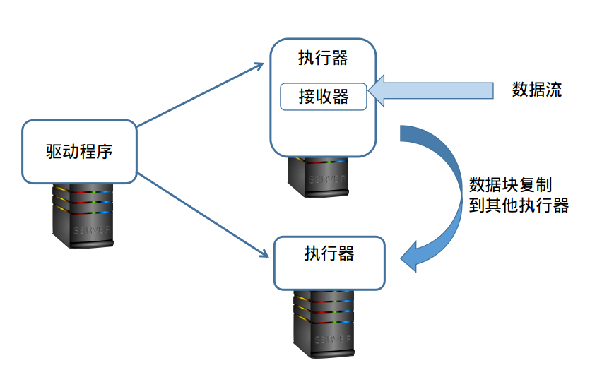
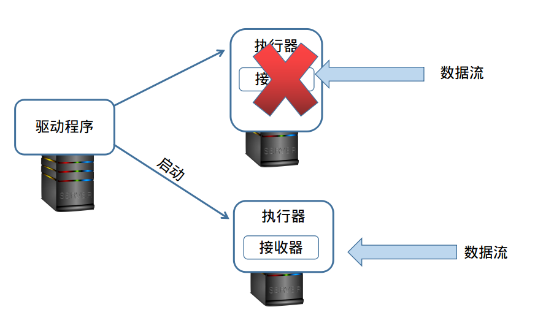
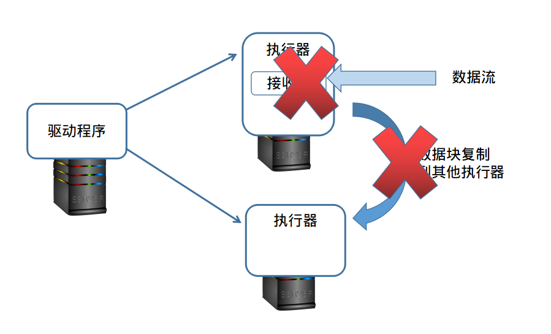
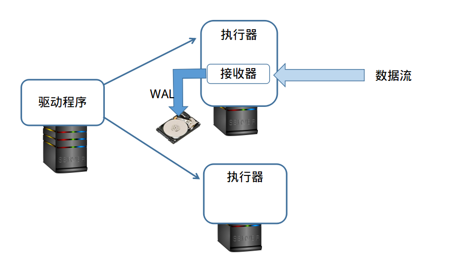
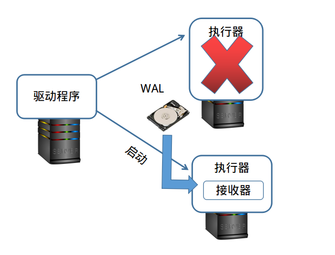
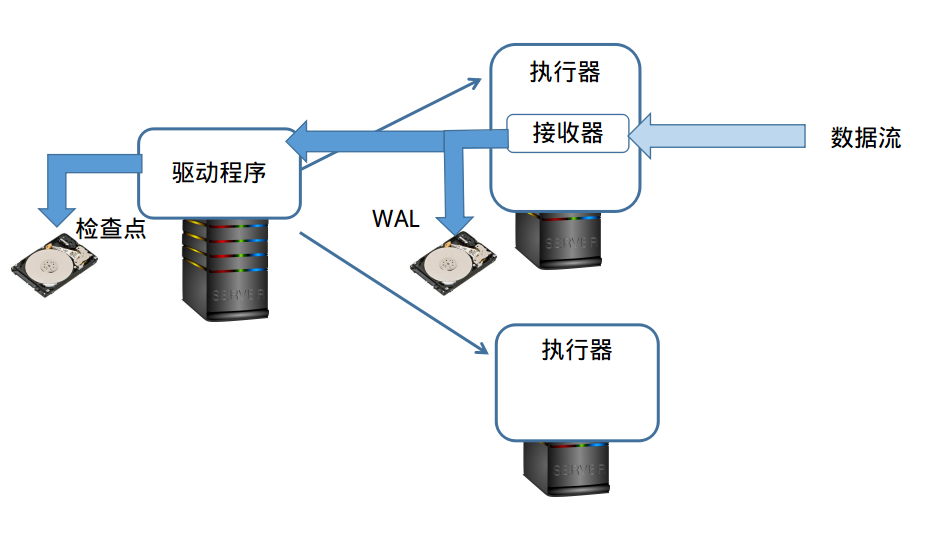

#ADP2.0实时流数据处理的数据可靠性简介

1 运行架构  
ADP平台运行时的架构
  
图一    
驱动程序驱动多个执行器运行，并在执行器上启动接收器接收流数据。
执行器可以在多个节点上运行，此处为表示概念只画了两个。
从上图我们知道，当数据注入时是在接收器向所在的执行器注入流数据，
如果执行器崩溃，那么已注入的数据就丢失了

2 数据复制  
向平台注入流数据，我们需要编写自己的`Receiver`,Receiver的定义如下
```scala
abstract class Receiver[T](val storageLevel: StorageLevel) extends Serializable 
```
这时我们可以定义传入`StorageLevel`参数为诸如`MEMORY_ONLY_2`，
那么平台会将执行器上的数据块会复制到其他执行器上，如图所示

图二  


3 重新选择执行器  
如果执行器和接收器失效，那么驱动程序会使用另一个执行器上的已经复制的数据进行处理，
并自动启动一个新的接收器接收数据

图三  

4 WAL  
如果复制失败，然后执行器又发生崩溃，那么这部分已经进入系统内存的数据就发生丢失  

图四  


为解决这个问题我们在执行器上引入先写入日志(WAL)系统,将数据持久化到硬盘上
平台在注入数据的同时将数据写入日志（类似于数据库的事务日志）

图五  


如果数据未处理而执行器崩溃，那么重新选择执行器启动接收器和并从日志中读入未被处理的数据即可。


图六  


5 检查点  
由于执行器由驱动程序指挥，如果驱动程序崩溃，与此相关的执行器都会退出
那么这里就还有一个问题，注入系统或写入日志的数据元信息是保存在驱动程序中的，
如果这时驱动程序崩溃，系统就不知道哪些数据处理过了，哪些没有处理过。
为了解决驱动程序可靠性的问题我们引入检查点(CheckPoint)机制，ADP的流处理是一种微任务(micro-batch)模式，
在一定节奏的时间内会有一系列的任务产生，那么我们在微任务启动的时候会在磁盘上记录驱动程序的状态，
任务结束的时候清除已处理的数据的元信息。

图七  


如果驱动程序崩溃，重启驱动程序的时候，根据检查点的状态就知道任务的状态，
综合检查点和WAL我们可以恢复现场，从上次未完成的重新开始处理数据了。