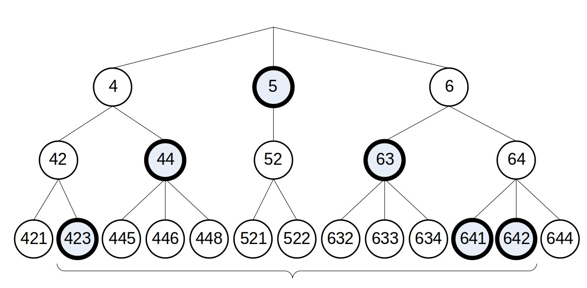

# Lucene是怎样搜索数字范围的

* 注这个算是用在Lucene 5.0之前的版本

Lucene的索引是用字符串存储一个个term，按term形成倒排表
如果423按一个term存储，那么查找[422-643]就要查找这个范围内的222个整数term，如果范围大的话，或者精度高的话那么要查找大量的term
比如搜索-10.00005到10000.256789

## 原理
根据[Uwe Schindler的片子](http://www.thetaphi.de/share/Schindler-TrieRange.ppt)

数字按图中树存储Term,比如423存储3个term 4,42,423，这就是step是10的分解term的方法
如果要找[422到643]之间的数，
1 先在最小精度里查找，也就是查找[422-429]和[640-643]，一共12个term, 这里找到423和641,642
2 然后找下一精度查找[43-49]和[60-64]，一共12个term，找到44(445,446,448)以及63(632,633,634)
3 最后找最高精度[5]，一个term,那么可以找到5(521,522)
这样总共查找了22个term，比之前的方法少了数量级

## 实现

1 整数 

1.1 转换 
 
Java采用的是two's complement binary representation,正数符号位是0,负数符号位是1,后面是补码，例如x是正数，
那么负数就是(~x+1)
Lucene对2补码数做异或^0x80000000处理，`int sortableBits = val ^ 0x80000000;`
0x800 0000就是b1000 0000 0000 0000,也就是第32为1,因为Java的整数就是32位，
那么实际就是去掉了符号位，这样所有整数就在一个可以比较的空间

1.2 存储 
 
因为Lucene用UTF-8存储字符，那么存数字每个char能用的是7位，Lucene最大用char[6] (最大精度是用6个字符)来表示整数
每个char表示整数的7位，第0个char表示精度，缺省是4位为一个精度(step) 

`int nChars = (31-shift)/7 + 1, len = nChars+1;` 

那么比如数字100就是0x0000064,转换后就是0x80000064,按4位精度分解成0x8000 0064,0x8000 006,0x8000 00,
0x8000 0, 0x8000, 0x800, 0x80, 0x8这样8个term,每个term 最大6个char(16位), 一共32(6,5,5,4,4,3,3,2)个字符，32*16=512位，膨胀不少

