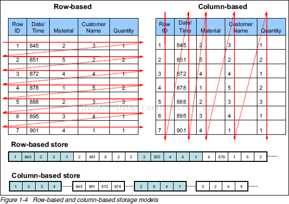
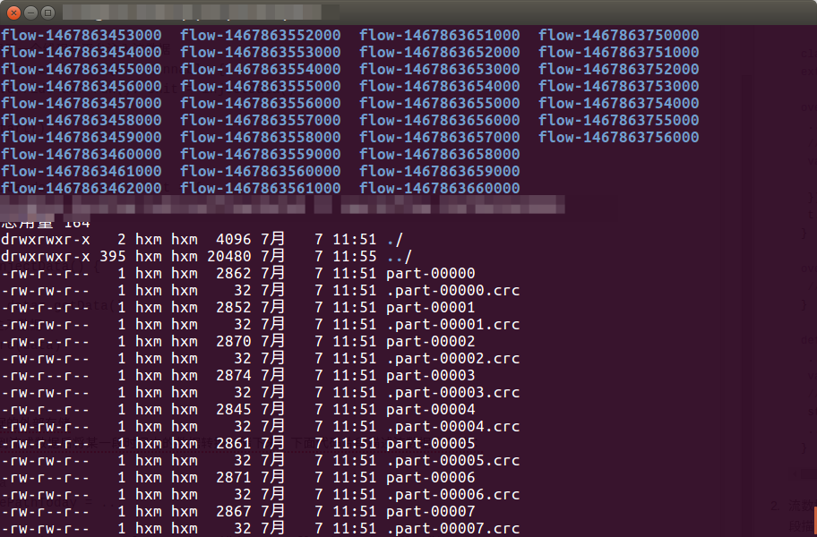
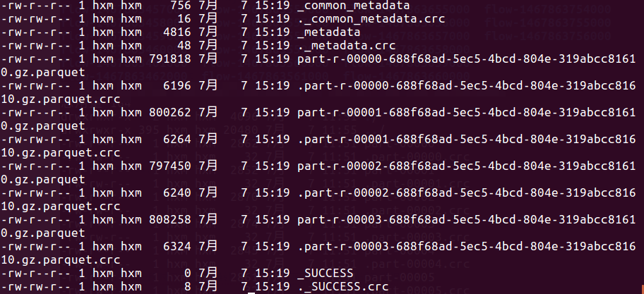

# ADP平台上流数据的转存与列式处理

ADP既可以用来处理普通大数据也可以用来处理流式数据，流式数据是每时每刻都在产生没有开始没有结束的数据，为了节约内存和简单可靠，我们一般在收到一定量的流数据后就转存到磁盘上，这样就会产生大量的小文件，为了提高下一步分析处理效率与方便，我们再按比如天我们合并这些小文件并转换为列存储。


### 关于列存储
我们常用的关系数据库都是行存储，也就是数据按行中的列一行一行存储，一行数据保存在一起，这样在查询某一行数据时扫描一次就能得到所有这一行数据。但是在做大数据处理时常常要基于某一列或多列做聚合计算，这样就要将所有的数据都读一遍才能获得结果，效率可想而知。列存储顾名思义则按列存储数据，如果我们需要基于某一列或多列计算则只需要读取这一列或几列数据即可。行存储与列存储示意如下图:
  

###编写自己的Receiver向平台注入流数据
首先我们需要编写自己的Receiver向ADP平台内注入流数据，代码片段如下  
```scala
class MyReceiver(storageLevel: StorageLevel = StorageLevel.MEMORY_AND_DISK)
  extends Receiver[T](storageLevel) with Logging{
  
   override def onStart(): Unit = {
    ...
    //用另一个线程向平台注入流数据
    val t= new Thread(new Runnable {
      override def run(): Unit = injectData()
    })
    t.start()
  }

  override def onStop(): Unit = {
    //release resources
  }
  
  def injectData() {
    ...
    val data= getData()
    //注入数据
    store(data)
    ...
  }
```

###流数据的外部存储
平台在收到流式数据后将某一段时间内的数据转换存储下来，下面代码片段描述流数据的存储：

```scala
val SavePathToday = ...

val flowReceiver = new MyReceiver(...)
val flowStream = ssc.receiverStream(flowReceiver)
//存储流数据
flowStream.saveAsObjectFiles(SavePathToday)
```
`saveAsObjectFiles`方法自动按秒生成子目录，并在这个目录内存储这一秒产生的流数据，如图
  

###流数据小文件的合并与列式存储  
代码片段如下：
```scala
  val SavePath=...
  val DesiredPartitionNumber=...
  //读取所有子目录
  sc.hadoopConfiguration.set("mapreduce.input.fileinputformat.input.dir.recursive","true")
  val rdd: RDD[T]= sc.objectFile(SavePathToday+"/*")
  val df=sqlContext.createDataFrame(rdd)
  //合并并存储
  df.coalesce(DesiredPartitionNumber).write.parquet(SavePath)
```
首先用'coalesce'合并数据文件，并按`DesiredPartitionNumber`重新分区，然后调用`parquet`对数据按列存储，关于`parquet`参见[Apache Parquet](http://parquet.apache.org/)
如果你不希望每天一个目录而是每个月一个目录可以修改`parquet`的写入方式为`Append`
合并后如下所示：

此例中合并后查询效率提高百倍以上